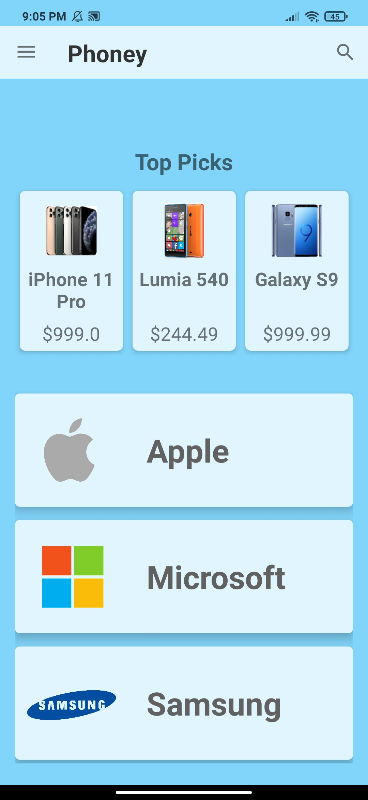
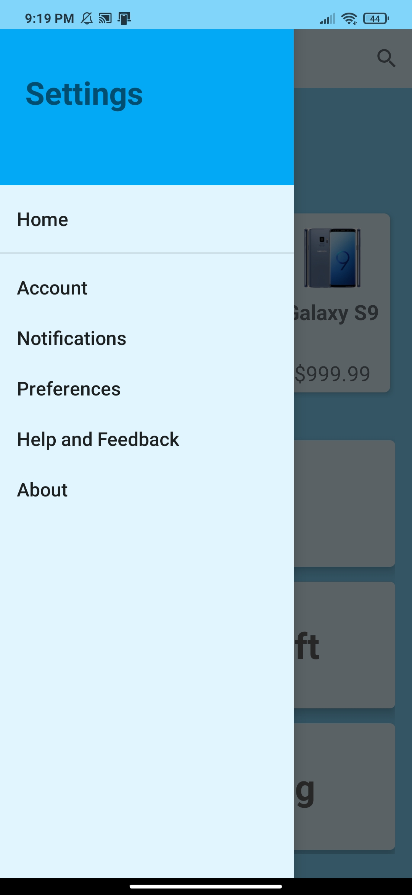
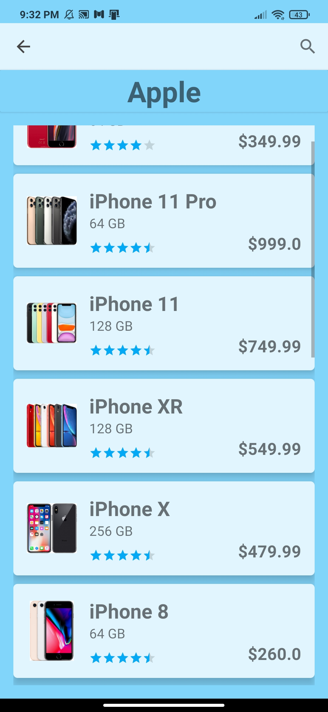
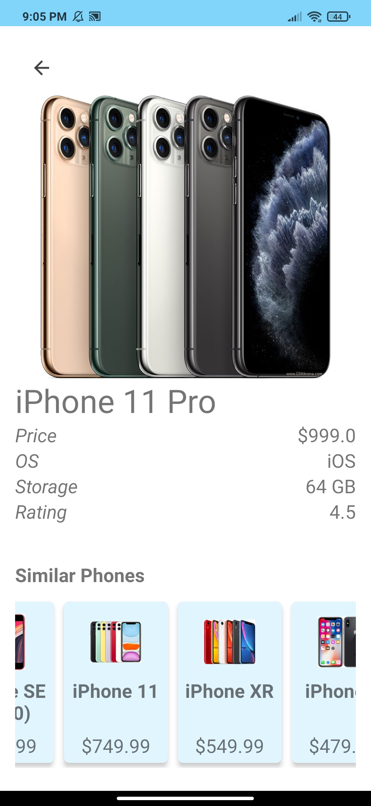

# Phoney
##### Android App - Java

A university pair-project to develop an android app inspired by Trade-Me.

It was built using Android Studio and the code was written in Java and xml.

This app has 3 main activities. A main activity, list activity and a details activity.

#### Main Activity
This activity has 6 fragments5 which display different settings, and a 6th that acts as the main/home view.
The settings menu can be accessed from the top left icon.
In the main activity the user can browse the *Top Picks* section for each category. It displays all 3 categories that the user can browse.
The user can also *search* for a specific item from the toolbar.

 

#### List Activiy 
This activity can be accessed from the main by either clicking on one of the categories or searching for a spcific phone.
It displays a list of all the related phones. The user can see the phone name, the storage capacity, phone rating and the price.
The user can also still search the category by using the search icon on the top right.

 

 

#### Details Activvity
The user can click on the phone cards from either the search results or the category list.
It will then open the details activity which displays the spcifications of the phone.
The user can also browse through 3 different images of the phone on the top.

This activity also has a *Similar Phones* section at the bottom.

 
